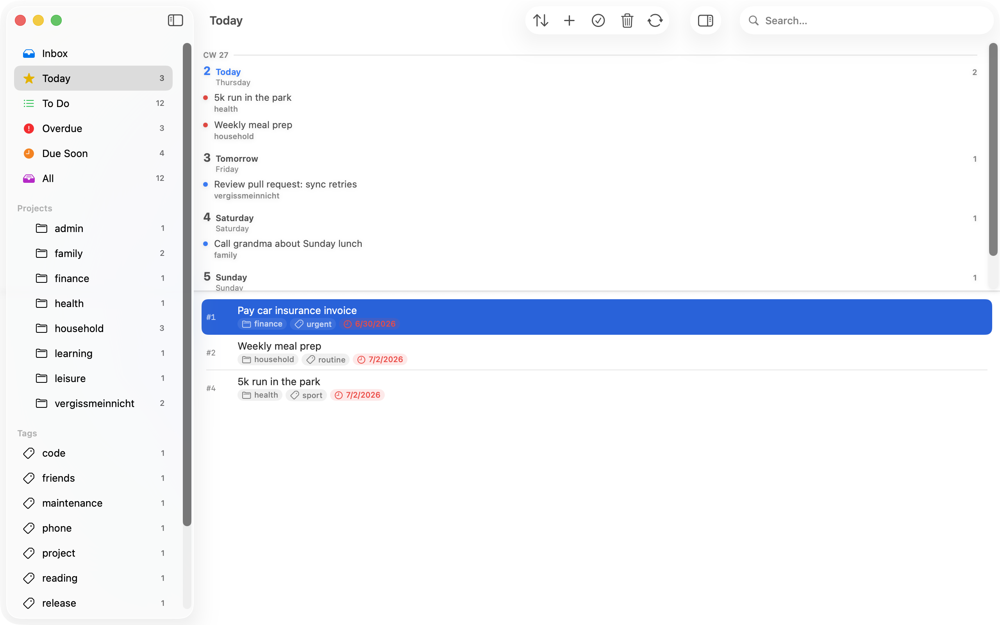

# Vergissmeinnicht

[](https://github.com/hnsstrk/vergissmeinnicht/actions/workflows/ci.yml)
[](https://github.com/hnsstrk/vergissmeinnicht/releases/latest)
[](LICENSE)

A native macOS client for [Taskwarrior](https://taskwarrior.org) 3.x, built on
[TaskChampion](https://github.com/GothenburgBitFactory/taskchampion). SwiftUI
front-end, Rust core via UniFFI, sandboxed, App-Store-friendly.

> **Vergissmeinnicht** is the German word for *forget-me-not* — a flower, and
> a reminder.

🇩🇪 [Deutsche Version](README.de.md)



## Features

- **Sidebar perspectives** — Inbox · To Do · Today · Overdue · Soon · Waiting ·
  Scheduled · All · per Project · per Tag. Counts per row, drop targets.
- **Full-text search with operators** (⌘F) — covers title, project, tags, and
  annotations across the entire store (pending, completed, recurring). Supports
  AND, quoted phrases, and `project:`, `tag:`, `status:` operators (German and
  English aliases). When a search is active the sidebar filter is ignored.
- **Saved searches** (⇧⌘D) — name a search and pin it to the sidebar between
  system filters and projects. Right-click to rename or delete. The section
  only appears once you save the first one.
- **Month calendar** (⇧⌘K, *View ▸ Calendar*) — GUI counterpart of Taskwarrior's
  `task calendar`. Month grid rendering only native fields: `due` as a chip on its
  day, a `scheduled`→`due` span as a multi-day bar, recurring tasks repeated per
  occurrence. Capped chips with a "+N" overflow; click a day for an agenda popover,
  click a task to open its detail. A slim **week forecast strip** above the task
  list shows per-day task counts and jumps into the calendar; toggle it in Settings.
- **Quick Capture** (⌘N) — focused capture sheet with title, notes, project, tags,
  due, priority, recurrence. Or terminal-style tokens (`+tag project:foo
  due:tomorrow`).
- **Detail editor** in its own window — title, project, tags, due, scheduled,
  priority, recurrence, annotations (with Markdown rendering).
- **Multi-select** with bulk done / delete / project / tag / priority / due
  via context menu, native `contextMenu(forSelectionType:)`.
- **Drag & drop** tasks onto projects, tags, or Inbox (clears project + tags).
- **Recurring tasks** — daily / weekly / monthly / yearly + `Nd / Nw / Nm /
  Ny`. Completing a recurring task atomically creates the next instance.
- **Snooze / Wait** — defer tasks; they appear under "Waiting" instead of
  cluttering Today.
- **Tag and project management** — right-click in the sidebar to rename or
  clear from all tasks.
- **Notifications** — opt-in summary at launch when overdue tasks exist.
- **Localization** — German (source) and English, with manual override.
- **Sync** against any [taskchampion-sync-server](https://github.com/GothenburgBitFactory/taskchampion-sync-server)
  you point it at. Credentials in the macOS Keychain.
- **Automatic backups** — `VACUUM INTO` snapshot before every sync, rotated to
  the last 10. Manual backup and restore from settings. See
  [`docs/backup-and-restore.md`](docs/backup-and-restore.md).

## Architecture

```
┌─────────────────────────────────────────────┐
│  SwiftUI App (Main window + MenuBarExtra)   │
│  Sidebar · TaskList · Detail · Settings     │
└──────────────────┬──────────────────────────┘
                   │  UniFFI-generated Swift wrapper
┌──────────────────▼──────────────────────────┐
│  VergissmeinnichtKit (SwiftPM)              │
│  Binary target: VergissmeinnichtCoreFFI     │
└──────────────────┬──────────────────────────┘
                   │  C ABI
┌──────────────────▼──────────────────────────┐
│  vergissmeinnicht-core (Rust)               │
│  taskchampion 3.0.1 · tokio · uniffi 0.29   │
│  Replica = SQLite in app sandbox container  │
└──────────────────┬──────────────────────────┘
                   │  HTTPS
┌──────────────────▼──────────────────────────┐
│  taskchampion-sync-server (your own)        │
└─────────────────────────────────────────────┘
```

The app runs sandboxed. Its replica lives in
`~/Library/Containers/de.hnsstrk.vergissmeinnicht/Data/Library/Application Support/`.
There is no direct access to `~/.task/` — sync goes through the server.

See [`docs/architecture.md`](docs/architecture.md) for the design rationale behind
the container hierarchy, the `u32` working-set ID, and the replica lifecycle.

## Download

Pre-built `.app` bundles are available **arm64-only** (Apple Silicon, macOS 14+):

- **Releases** — versioned builds at [github.com/hnsstrk/vergissmeinnicht/releases](https://github.com/hnsstrk/vergissmeinnicht/releases).
- **Dev builds** — every CI run on `main` uploads a Debug build as workflow artifact
  ([latest CI runs](https://github.com/hnsstrk/vergissmeinnicht/actions/workflows/ci.yml)).
  14-day retention.

Both downloads are **unsigned**. macOS Gatekeeper will block the launch unless
you remove the quarantine flag:

```sh
unzip Vergissmeinnicht-*.zip
xattr -dr com.apple.quarantine Vergissmeinnicht.app
open Vergissmeinnicht.app
```

There is no notarized release yet — that requires an Apple Developer ID
($99/year) and is on the backlog. If you want signed builds, build from source.

## Requirements

- macOS 14 Sonoma or later (arm64; Intel support is on the backlog)
- Xcode 16 with Swift 6 toolchain
- Rust toolchain (Homebrew works; `rustup` recommended)
- [XcodeGen](https://github.com/yonaskolb/XcodeGen) — only if you want to
  regenerate the Xcode project from `app/Vergissmeinnicht/project.yml`. The
  checked-in `Vergissmeinnicht.xcodeproj` is hand-maintained at this point.

## Build

```sh
# 1. Build the Rust core, generate Swift bindings, build the xcframework
./scripts/build-macos.sh

# 2. Open the app in Xcode
open app/Vergissmeinnicht/Vergissmeinnicht.xcodeproj

# 3. Or build via CLI
xcodebuild -project app/Vergissmeinnicht/Vergissmeinnicht.xcodeproj \
           -scheme Vergissmeinnicht \
           build
```

Run the test suite:

```sh
# Rust
cargo test --manifest-path rust/Cargo.toml

# Swift package (FFI roundtrips, metadata, write ops, sync)
swift test --package-path swift/VergissmeinnichtKit
```

## Sync setup

1. Run your own [taskchampion-sync-server](https://github.com/GothenburgBitFactory/taskchampion-sync-server)
   (or use an existing one).
2. In the app, open **Settings → Sync Server** and fill in URL, Client ID, and
   the encryption secret. They are stored in the Keychain
   (`kSecAttrAccessibleWhenUnlockedThisDeviceOnly`).
3. Click **Test sync**. Done.

The app and the `task` CLI on other machines reconcile through the sync server.
TaskChampion resolves conflicts CRDT-style via its operation log.

## Project layout

```
.
├── app/Vergissmeinnicht/   SwiftUI app, xcodeproj, resources, entitlements
├── rust/                   Cargo workspace
│   └── vergissmeinnicht-core/   Rust core, UniFFI exports
├── swift/VergissmeinnichtKit/   SwiftPM package wrapping the xcframework
├── scripts/build-macos.sh  cargo + uniffi-bindgen + xcframework build
└── docs/                   architecture notes, backup recovery, change logs
```

## Hooks: out of scope by design

Taskwarrior hooks are a feature of the `task` CLI, not the TaskChampion
library this app uses. Equivalents (reminders, validation, auto-tagging) are
implemented natively in Swift — no subprocesses, sandbox-clean.

## Acknowledgements

- [Taskwarrior](https://taskwarrior.org) and the GothenburgBitFactory team for
  [TaskChampion](https://github.com/GothenburgBitFactory/taskchampion) and the
  sync server.

## License

[MIT](LICENSE).
